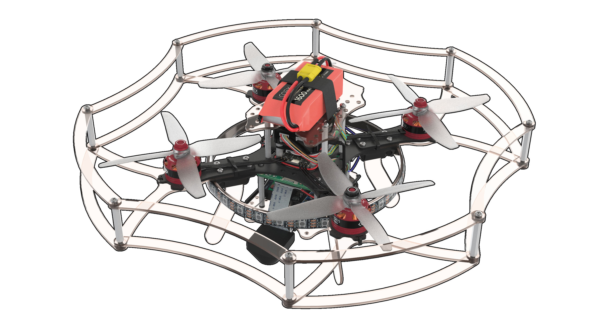
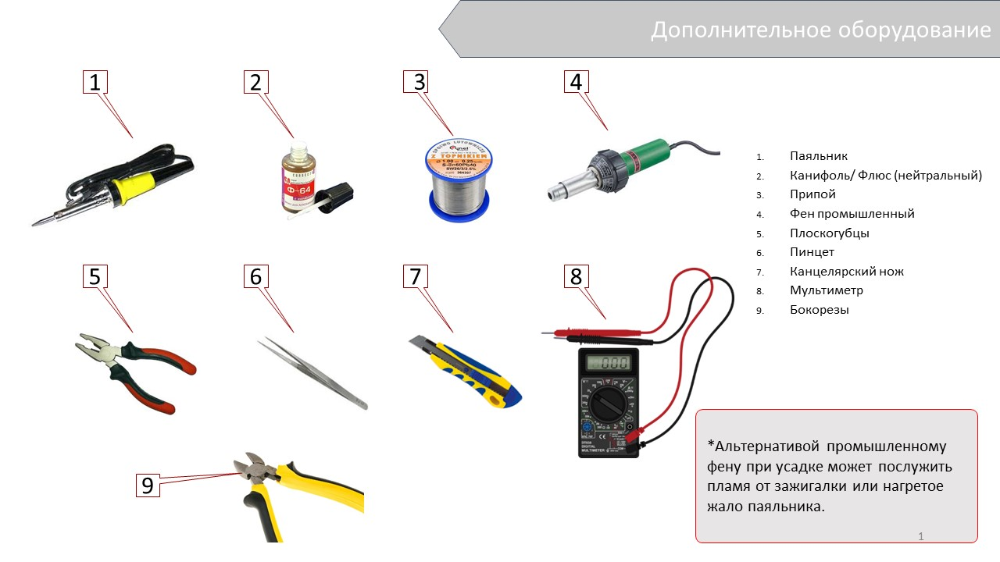
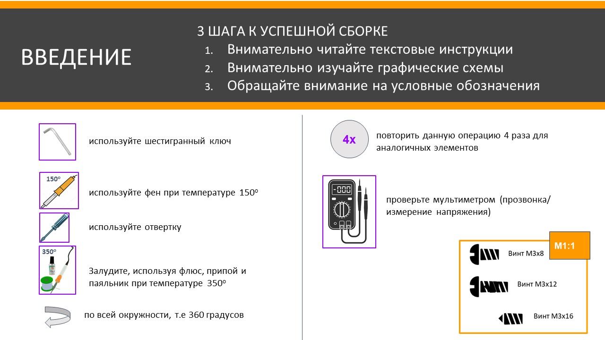
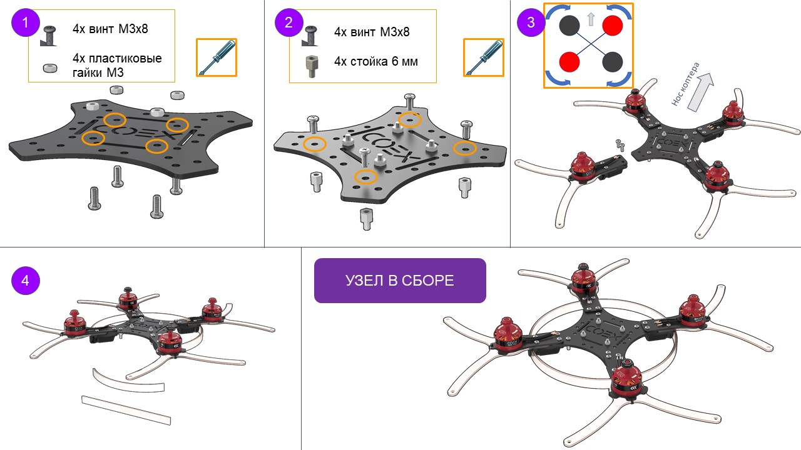
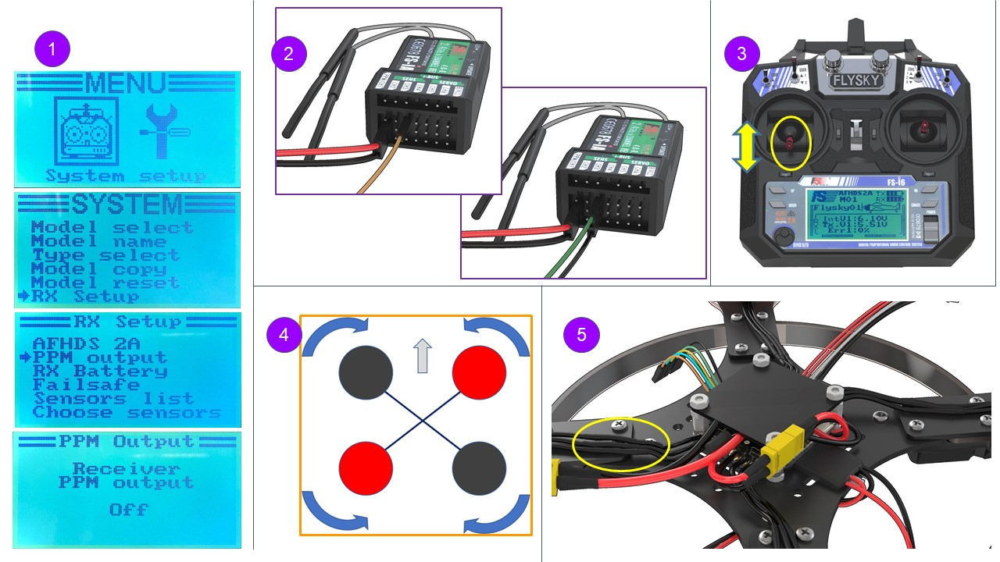
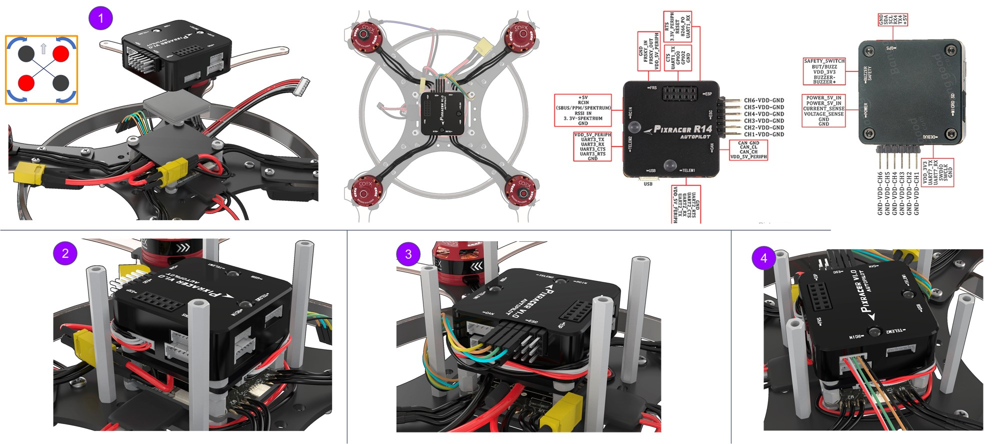
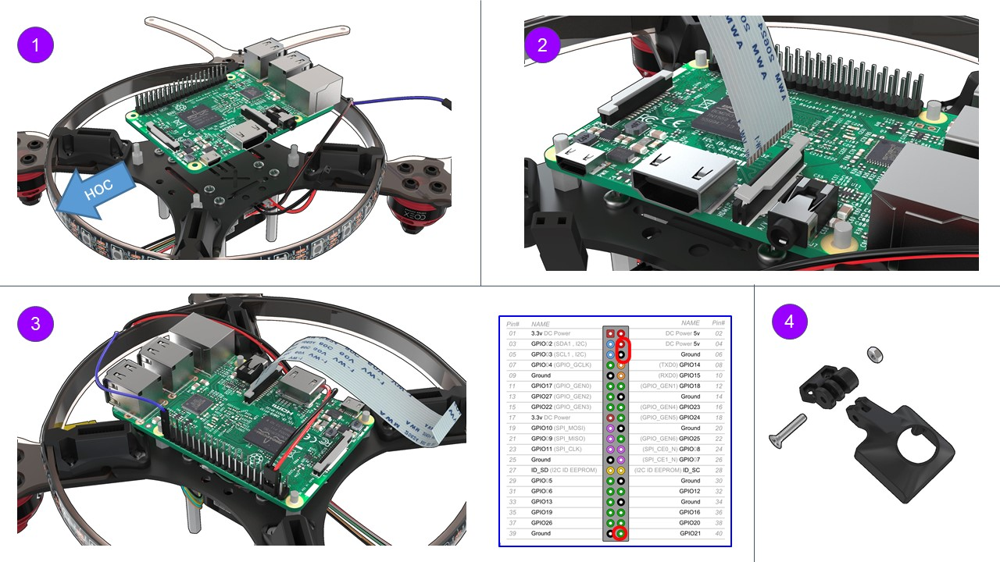
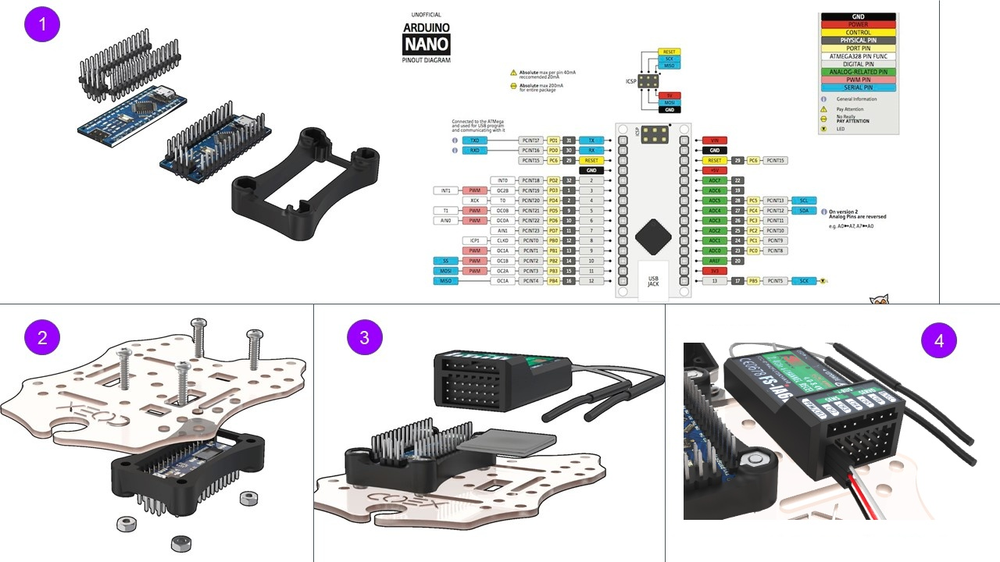
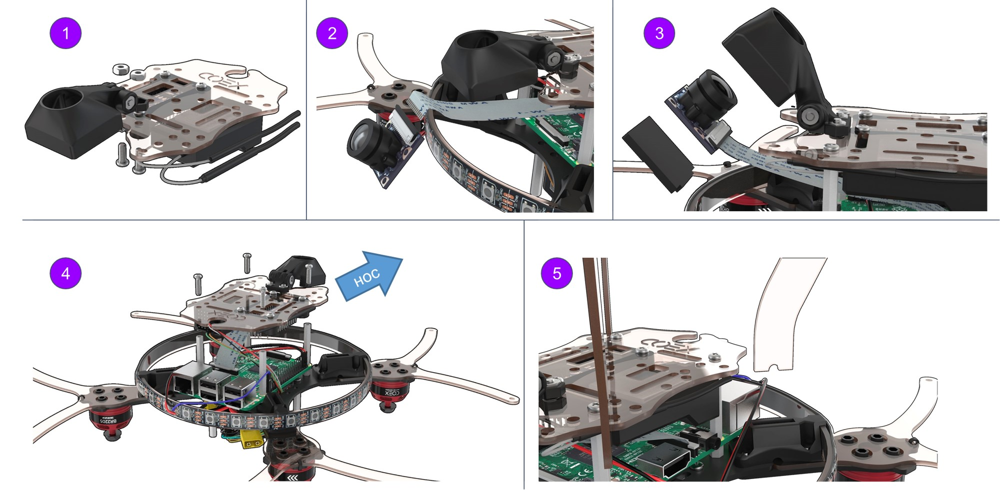
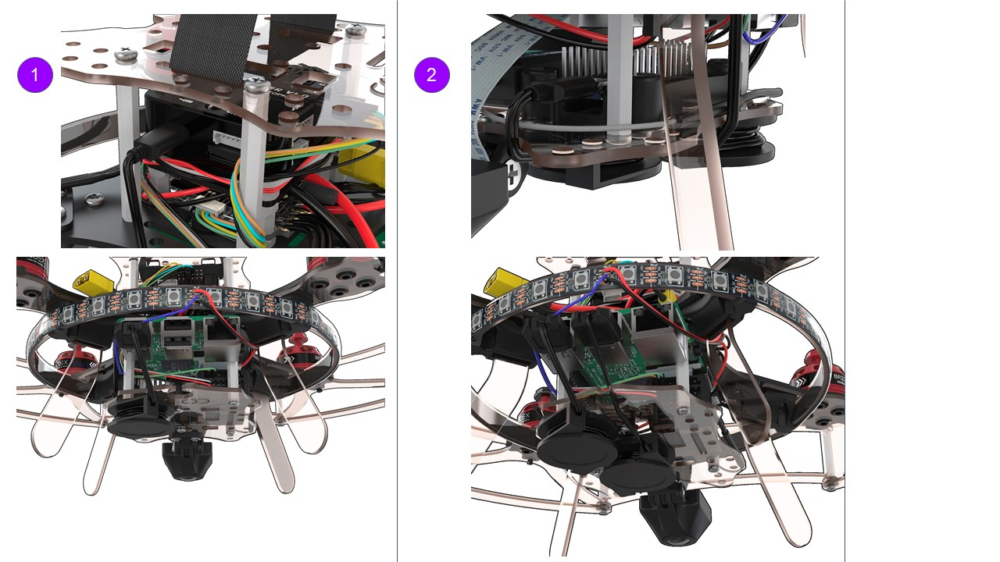

# Сборка Клевера 3

В данной инструкции рассматривается сборка комплекта COEX Clever 3 с платой регуляторов 4в1.

> **Caution** Перед использованием паяльного оборудования обязательно ознакомьтесь с [техникой безопасности при пайке](tb.md).

<!--
## Состав конструктора

TODO
-->

## Дополнительное оборудование

## Условные обозначения

## Установка моторов

1. Распаковать моторы.
2. Закрепить мотор на луче шестигранными винтами М3х6 (самые короткие винты в комплекте с моторами).

    Шестигранный ключ в комплекте.

3. Вставить гайки М3 (4 шт) в пластиковый держатель.

    Для удобства можно использовать длинный винт, либо плоскогубцы

4. Закрепить луч, нижнюю защиту луча и держатель винтами М3х12, используя крестовую отвертку.
5. Скрепить хомутом луч и нижнюю защиту луча.

    Хвост от хомута (стяжки) отрезать ножницами.

    

## Монтаж каркасных элементов

1. Установить пластиковые гайки М3 (4 шт) для крепления PDB на раму винтами М3х8.
2. Установить стойки 6 мм (4 шт) для крепления RASPBERRY PI на раму винтами М3х8.
3. Установить на раму собранную конструкцию, соблюдая схему, винтами М3х16.
4. Установить каркас для светодиодной ленты, используя прорези в держателях для ножек.

## Монтаж преобразователя напряжения BEC (припаять и проверить)

1. Распаковать плату питания и установить шлейф питания.
2. Включить мультиметр в режим измерения постоянного напряжения (диапазон 20В или 200В).
3. Проверить работоспособность платы питания, подключив АКБ
    * Выходное напряжение на разъеме XT30 должно равняться напряжению на АКБ (от 10В до 12.6В).
    * Выходное напряжение на шлейфе питания должно быть в пределах 4.9В до 5.3В.
    * Измеряем между черным и красным проводами.
4. Распаковывать преобразователь напряжения и снимаем прозрачную изоляцию.
5. Припаять два дополнительных провода на BEC
    * Взять из набора 3 провода папа-мама (красный, черный и любого цвета)
    * Красный и черный [залудить](zap.md) с обеих сторон, используя пинцет. На синем проводе залудить со стороны коннектора ПАПА.

        Залудить - это:
        * Нанести флюс на оголенную часть провода.
        * Покрыть припоем.

    * Припаять красный и черный провода к BEC:

            ЧЕРНЫЙ -> OUT-
            КРАСНЫЙ -> OUT+

6. Проверить работу BEC.
    * Припаять BEC на плату питания:

            ЧЕРНЫЙ -> -
            КРАСНЫЙ -> +

    * Подключить АКБ и проверяем напряжение на припаянных проводах к BEC (из пункта 5).

        5В - все правильно!

        больше 10В - отключите питание и переставьте желтую перемычку на другой пинцет.

        0В - плохо спаяли.
    * Если BEC выдает 5В, то изолируем паячное соединение черной термоусадкой.
7. Монтаж светодиодной ленты.

    * Припаять провода от BEC (из пункта 5) к светодиодной ленте.
    * Удалить силиконовый слой на ленте (надрезать ножом и оторвать).
    * [Залудить](zap.md) контакты светодиодной ленты.

            Красный -> +5V
            Черный ->  GND
            Синий -> Din

## Монтаж платы регуляторов 4в1 и платы питания PDB

1. Установить плату регуляторов 4в1, как показано на картинке.

    Соединить фазные провода моторов с проводами регуляторов.

2. Закрепить плату регуляторов стойками 6 мм (4 шт.).

    На стойки накрутить пластиковые гайки М3 (4 шт.).

3. Установить плату распределения питания PDB, как показано на картинке (разъем XT60 направлен к хвосту коптера).
4. Соединить разъемы питания платы питания и платы регуляторов XT30.

 

## Сопряжение приемника и пульта

1. Подключить провод 5В от BEC в разъем приемника.

    Установить BIND разъем в крайний правый порт B/VCC.

2. Подключить АКБ. Индикатор на приемники должен быстро мигать (режим сброса).
3. Зажать и удерживать кнопку BIND на пульте и включаем пульт.

    На пульте отображается процесс сопряжения RXBinding

5. После установки сопряжения (появление допю строк на дисплее пульта):
    * Убрать BIND разъем из приемника.
    * Отключить АКБ.

> **Hint** Если пульт не включается или заблокирован, см.
статью [неисправности пульта](radioerrors.md).

## Проверка направления вращения моторов

1. Включить пульт.

    Убедиться, что ppm в меню RX Setup отключен ([раздел "Нет связи с полетным контроллером"](radioerrors.md))

    В пункте 3 выберите “RX setup” > “PPM OUTPUT” > “Off”.

    Сохраните изменения (удерживаем нажатой кнопку “CANCEL”).

2. Подключить оранжевый провод S1 от платы регуляторов в CH3 на приемнике. Подключить внешнее питание.
3. Подать левым стиком газ (throttle) на 10%.
4. Проверить направления вращения мотора по схеме.Повторить для каждого мотора. Таким образом, будет понятно каким именно мотором мы управляем.
5. Если необходимо изменить направление вращения, то меняем любые два фазных провода мотора (нужно переподключить).

## Монтаж и подключение полетного контроллера Pixracer

1. Установить Полетный контроллер Pixracer на двухстороний скотч 3М (2-3 слоя).
    Также полетный контроллер можно извлечь из корпуса и жестко установить на стойке М3х6.

2. Установить стойки 40 мм, используя винты М3х87.

    Подключить разъем POWER.

3. Подключить регуляторы, как на картинке.

    Подробно [про подключение регуляторов 4в1](cl3_connectESC4in1.md).

4. Подключить шлейф радиоприемника в разъем RCIN в Pixracer.

## Монтаж Raspberry

1. Перевернуть коптер.

    Установить Raspberry на стойки, используя монтажные отверстия Raspberry.

    USB-разъемы направлены к хвостовой части коптера.

2. Установка шлейфа для камеры:
    * поднять защелку;
    * подключить шлейф;
    * закрыть защелку.
3. Подключение питания Raspberry:

        5В -> pin 04 (DC power 5v)
        GND -> pin 06 (Ground)
        Подключение светодиодной ленты pin 40 (GPIO21)

4. Сборка маунта для камеры RPi.

    Используйте винт М3х16 и гайку М3

## Монтаж Arduino и радиоприемника FlySky

1. Произвести монтаж пинов микроконтроллера Arduino Nano, используя пайку.
2. Установить миконтроллер в специальной маунт и прикрепите к нижней деке, используя винты М3х16 (4 шт.).
3. Используя 2хсторонний скотч, прикрепить приемник, как показано на рисунке.
4. Подключить шлейф радиоприемника от Pixracer как на рисунке.

        белый -> PPM
        красный -> 5V
        черный -> GND
        оранжевый, зеленый -> сейчас не используются. Устанавливаются в неиспользуемые пины радиоприемника

## Монтаж камеры RPi

1. Установить маунт для камеры Rpi в сборе на нижнюю деку винтами М3х12 (2 шт.).
2. Подключить шлейф к камере RPi.
3. Установить камеру в маунт, закрепить саморезами М2.
4. Закрепить Raspberry стойками 30 мм (4 шт.).

    Установить нижнюю деку в сборе на стойки винтами М3х8 (4шт.)

5. Установить ножки в маунты (4 шт.).

## Монтаж остальных конструктивных элементов

1. Установить нижней защиты, используя винты М3х12 (8 шт.) и стойки 30 мм (8 шт.).
2. Установить верхней защиты, используя винты М3х12 (8 шт.).
3. Установить ремешок в верхнюю деку для фиксации АКБ.

    Закрепить верхнюю деку винтами М3х8 (4 шт.)

## Монтаж USB соединителей

1. Соедините Pixracer и Raspberry, используя micro USB - USB кабель.
2. Соедините Arduino и Raspberry, используя micro USB - USB кабель.

.

Подробнее про подключение см. [статью](connection.md).
