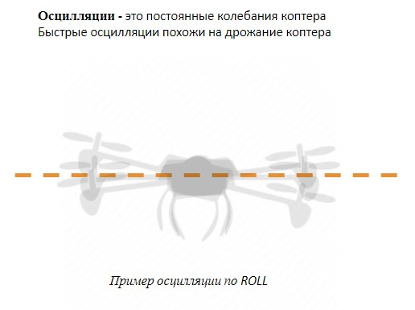

# Configuring the PID coefficients

In practice, the most common problem is the presence of rapid oscillations that occur due to the too large values of parameter P. In this situation, you should decrease this value (all parameters are set experimentally, based on copter behavior).

It is also worth checking that the oscillations do not occur during sharp descent (otherwise, reduce P).
Slow copter rocking from side to side while trying to maintain the predetermined position is related to excessive value I.
If the copter swings during movement, the value should be increased.
If the copter keeps the preset position poorly, you should increase the D parameter; it the D parameter is too high or too low, oscillations occur.

> **Note** Adjustment of the D parameter should start with the minimum values, which are 3 – 4 times lower than default values, if any.

The Rate Pitch and Rate Roll parameters should be the same.

YAW parameters should be changed individually, according to the above instruction (usually the yaw doesn't require serious adjustment, you may leave it default).

