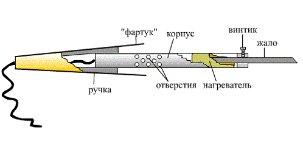

Safety instruction
===

Soldering
-----

### Preliminary examination

Before you start, check the integrity of the wiring and the plug.
Damage may cause electric shock.

### The soldering tip

The soldering tip heats up to very high temperatures, so if it touches an electrical wire during soldering, the insulation will be damaged in a matter of moments, followed by a short circuit.

### Soldering iron prop

When working with a hot soldering iron it is important to use a prop. If you don't have a factory-made prop, you can use the one made of a wooden block and metal holders. The prop allows placing the tool without the risk of it falling down on combustible materials.

### Ventilation

When melted, colophony and solder can emit significant amounts of hazardous substances.
It is strongly advised to ventilate the room after each soldering.
Make short breaks with through ventilation every 30 minutes, do not forget to turn off the soldering iron.

### How to hold a soldering iron?

A soldering iron may only be held by the handle.
If anyone says the opposite – don't believe him, he is trying to misguide you:)

[More about soldering safety](tb.md)

Flying
------

### Safety during preparation to flying

* Make sure that the Li-ion batteries are charged.
* Make sure the batteries in the control equipment are charged.
* Attach the propellers immediately before flying.

Check the following:

* Tightness of propeller nuts.
* Attachment and integrity of propellers guards.
* Reliability of wires attachment, absence of loose wires.

### Safety before flying

* Place the spectators behind the pilot, or behind the line passing through both shoulders of the pilot behind the pilot.
* Do not allow spectators into the hemisphere in front of the pilot.
* Know and remember the flight duration that the copter and its battery are designed for.
* BEFORE connecting the Li-ion battery enable control equipment (the remote), and set the left stick (throttle) to the zero position.
* Connect the Li-ion battery immediately before takeoff, disconnect it immediately after landing.
* Stay at least 3 m away from the copter.
* Take off from a level flat site at the distance of at least 3 meters away from obstacles.

### Flight safety

* Follow all instructions of the teacher or the flight instructor.
* Specify the flying area in advance. Only fly in the specified area, and avoid flying outside it. Not to fly over behind your back.
* When learning to fly, fly below the level of your height.
* Fly in proximity to yourself at a distance at which you can see the copter orientation in space. Do no fly far away from yourself. If you doubt copter orientation, immediately land on the spot. Do not try to take off. Approach the copter and take off.
* During the flight, move the control sticks carefully and smoothly. Avoid abrupt movements. If you have to change the flight direction, move the sticks vigorously, but not abruptly.

> **Caution** Never move the sticks abruptly. Do not move the stick to the extreme position.

* Fly carefully, and perform only those flight elements that you are sure you can perform. Never perform the flight maneuvers that you doubt you can perform, and the maneuvers involving risks.
* Observe the speed limit. The copter speed should be maintained within the speed of a walking man.
* Return the copter to the landing location by the estimated time, prevent complete discharge of the battery during the flight.
* Land only on a flat open area away from obstacles

### Emergency landing

In case of hitting the ground or a heavy landing, do the following:

1. Stop the flight. Land the copter on the ground. Set the left stick (throttle) to the minimum
2. Disarm (Move the left stick left-down for 3 seconds)
3. Disconnect the Li-ion battery on the copter.
4. Turn off the remote.
5. Inspect the copter, and repair if necessary.

### Scheduled landing

After a scheduled landing, do the following:

1. Disarm (Move the left stick left-down for 3 seconds)
2. Disconnect the Li-ion battery on the copter.
3. Turn off the remote.