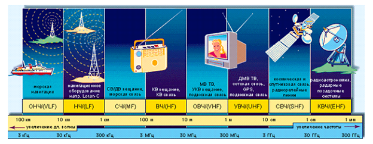
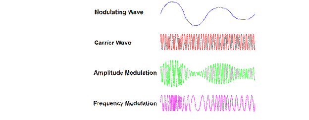
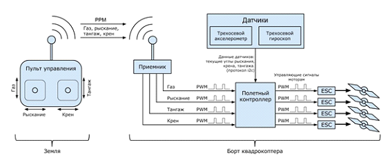
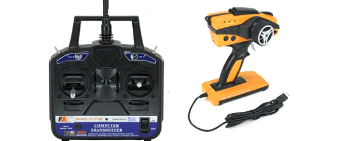
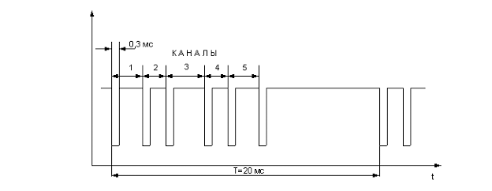
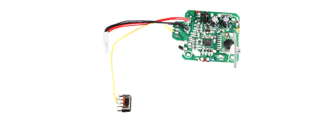
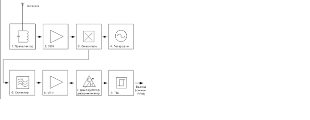

Тема 15. Основы радиосвязи. Принцип работы радиоаппаратуры управления
=====================================================================

Основы радиосвязи.
------------------

Радиосвязь - наиболее распространенный способ передачи информации на расстояние. Сотовые телефоны, спутниковая связь, телевиденье - все это работает на основе передачи сигналов через электромагнитные колебания определенной частоты. 
 

 
В передатчике формируются высокочастотные колебания определенной частоты (несущий сигнал). На него накладывается сигнал, который нужно передать, это называется модуляция полезным сигналом. Сформированный таким образом высокочастотный сигнал излучается антенной в виде радиоволн.  Этот сигнал воспринимается антенной приёмника, проходит через систему фильтров, которая выделяет из множества наведенных в антенне токов от различных передатчиков сигнал с нужной несущей частотой, а детектор выделяет из него модулирующий полезный сигнал.

В зависимости от несущей частоты передатчика, излучаемый сигнал обладает разными характеристиками относительно дальности распространения, рассеивания, способности отражаться и огибать препятствия. Радиоволны распространяются в пустоте и в атмосфере; земная твердь и вода для них непрозрачны. Однако, благодаря эффектам дифракции и отражения, возможна связь между точками земной поверхности, не имеющими прямой видимости (в частности, находящимися на большом расстоянии).
Примером модуляции сигнала может служить AM и FM. Это частные виды аналоговой модуляции в которых полезный сигнал передаётся либо за счет амплитуды волны, либо частоты.
 
 
 
### Принцип работы радиоаппаратуры управления.

Управление подвижными моделями основано на взаимодействии человека и модели, в нашем случае квадрокоптера. Аппаратура радиоуправления состоит из передатчика, который находится у пилота, и размещенных на модели приемника и полётного контроллера, который и управляет квадрокоптером через регуляторы мощности. О полётном контроллере и регуляторах мощности мы уже рассказывали, теперь рассмотрим Приёмник и передатчик.

### Передатчик

Различают 2 основных вида пультов - джойстиковые и пистолетные. Для квадрокоптеров используют джойстиковый пульт. 

Для управления движущимися моделями требуется воздействие одновременно на несколько функций, поэтому передатчики радиоуправления делают многоканальными. Для квадрокоптеров минимальное количество каналов - 4: управление газом, угол крена, угол тангажа, угол рысканья. Положение каждого из стиков пульта кодируется при помощи ШИМ импульса.

Каналы управления бывают двух типов: пропорциональные и дискретные. Например, пропорциональный канал - управление газом, а дискретный - включение/выключение подсветки. Дискретные каналы используются только для вспомогательных функций, все основные функции передаются с помощью пропорциональных каналов. Чем больше задач должен решать пульт, тем больше ему нужно каналов. Управление подвесом камеры, передача видео, телеметрии, все требует дополнительных каналов.

Пульт имеет возможность подстройки (триммирование). Любой квадрокоптер не идеален, центр масс у него может быть немного смещен в какую-либо сторону, какой-то из моторов может работать чуть лучше. Что проще - пытаться достигнуть идеальной симметричности модели и действий всех электромоторов, либо немного подстроить центральное положение ручек при помощи триммеров? Конечно же, все решают эту проблему подстройкой джойстика под каждую конкретную модель.

На выходе с пульта сигнал модулируется, чтобы передать данные на квадрокоптер. Модуляция сигнала позволяет наложить полезный сигнал на излучаемые волны, для этого все каналы уплотняются в один посредством кодирования. В основном для этого используется фазово-импульсная модуляция, обозначаемая буквами РРМ (Pulse Position Modulation), она распространена из-за единого стандарта на всем оборудовании. Пульт и приемник разных производителей могут работать вместе, привязка их друг к другу осуществляется за счет пары кварцевых резонаторов.
 

 
РРМ сигнал имеет фиксированную длину периода Т=20мс. Это означает, что информация о положениях ручек управления на передатчике попадает на модель 50 раз в секунду, что определяет быстродействие аппаратуры управления. Как правило, этого хватает, поскольку скорость реакции пилота на поведение модели намного меньше. Все каналы пронумерованы и передаются по порядку номеров. Значение сигнала в канале определяется величиною временного промежутка между первым и вторым импульсом - для первого канала, между вторым и третьим - для второго канала и т.д.

Диапазон изменения величины временного промежутка при движении джойстика из одного крайнего положения в другое определен от 1 до 2мс. Значение 1,5 мс соответствует среднему (нейтральному) положению джойстика (ручки управления). Продолжительность межканального импульса составляет около 0,3 мс. Данная структура РРМ сигнала является стандартной для всех производителей RC-аппаратуры. Значения среднего положения ручки у разных производителей может немного отличаться, а диапазон изменения у некоторых видов компьютерных передатчиков может быть шире, и достигать от 0,8 мс до 2,2 мс. Однако такие вариации допускают смешанное использование компонентов аппаратуры от разных производителей, работающих в режиме РРМ кодирования.

### Приёмник

Приёмник - устройство, служащее для осуществления радиоприёма, т.е . для выделения сигналов из радиоизлучения. Приёмник устанавливается на квадрокоптере, принимает сигнал с пульта и передаёт его  в полётный контроллер. 

### Принципиальная схема работы приемника
 
Сигналы, принятые антенной, подаются на колебательный контур, в котором работает приёмник. Этот контур является преселектором. После преселектора сигнал попадает в усилитель высокой частоты, а затем, уже усиленный сигнал подается на смеситель. На смеситель так же подается сигнал с гетеродина ( высокочастотного генератора). Антенна воспринимает сигналы со всех передатчиков, находящихся рядом, в смесителе происходит процесс первичной фильтрации сигнала. Из смесителя отфильтрованные сигналы поступают на селектор промежуточной частоты, который должен выбрать из всех полученных, сигнал "своего" приёмника и подавить остальные.  После этого сигнал проходит через усилитель промежуточной частоты и попадает на демодулятор-дискримнатор, где сигнал проходит обратную модуляции процедуру, когда принятого сигнала выделяется полезный сигнал. Затем он попадает на триггер Шмидта, который формирует необходимую амплитуду и крутизну PPM сигнала, а затем подается на декодер полётного контроллера.

Чтобы было понятно, рассмотрим на примере. Наш передатчик и приемник осуществляют связь по 50 каналу, 40,665 МГц. Частота гетеродина, чтобы определить "свой" сигнал обычно отличается на 455 кГц (0,455 МГц), соответственно она равна 40,665 МГц - 0,455 МГц = 40,210 МГц. Например, антенна приняла сигналы 40,665 МГц и 40,805 МГц, что соответствует 50 и 80 каналам. Они усилились при помощи УВЧ и попали в смеситель. Чтобы найти "свой" сигнал в смесителе происходит сложение и вычитание частот полученных сигналов и гетеродина. Получим:

40,665 МГц - 40,210 МГц = 0,455 МГц

40,665 МГц + 40,210 МГц = 80,875 МГц

40,805 МГц - 40,210 МГц = 0,595 МГц

40,805 МГц + 40,210 МГц =  81,015 МГц

Из полученных четырех значений 80,875 МГц и 81,015 МГц явно не подходят, т.к. разница должна быть 0,455 МГц, эти значения отфильтровываются на выходе смесителя. Оставшиеся два значения: 0,455 МГц и 0,595 МГц близки между собой, поэтому они проходят фильтр в смесителе и попадают в селектор, который фильтрует только "свою" частоту, 0,455 МГц, подавив остальные фильтром промежуточной частоты.
Отфильтрованный "свой" сигнал поступает на УПЧ, а затем, уже усиленный, он попадает на декодер и триггер Шмидта, где его преобразуют в PPM сигнал, который передается на полётный контроллер.

### Вопросы:

1)	Как происходит передача радиосигнала от передатчика к приёмнику?
2)	Чем отличается AM и FM модуляция передачи сигнала?
3)	Почему передатчики радиоуправления делают многоканальными?
4)	Какая модуляция используется в пультах управления коптерами?
5)	По какому принципу работает приёмник радиосигнала?
