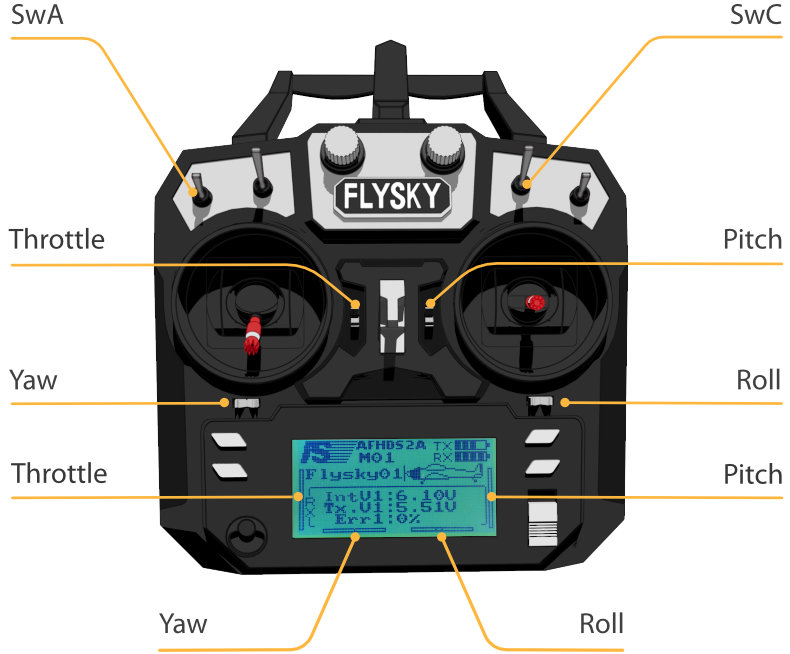

Предварительная настройка квадрокоптера
======

### 1. Состав пульта FLYSKY i6
---------------------


### 2. Установка QGroundCongtrol
* Скачиваем установочный файл для Windows/iOS по ссылке [QGroundCongtrol](http://qgroundcontrol.com/downloads/).
* Соглашаемся с установкой драйверов при инсталяции

### 3. Форматирование карты памяти

* Устанавливаем карту памяти microSD в адаптер
* Форматируем карту в файловую систему FAT32
  правый клие на диске > Форматирование
* Выполняем "Безопасное извлечение" карты напанели инструментов, далее извлекаем карту
* Устанавливаем micrSD карту в полетный контроллер Pixhawk.

### 4. Обновление прошивки Pixhawk


1. Заходим в Vehicle Setup.
2. Выбираем Firmware.
3. Отключаем Pixhawk от USB. Подключаем Pixhawk к USB снова.
4. Ждем подключения Pixhawk,  выбираем прошивку PX4 Flight Stack и активируем Advanced settings.
5. Выбираем тип прошивки Standard Version (stable). Если загружать собственную прошивку/ прошивку внешним файлом (например, скачанную из интернета), то выбираем Customize из выпадающего меню.
6. Кликаем OK.
7. Отключаем Pixhawk от USB.
8. Подключаем Pixhawk к USB снова.

### 5. Настройка Pixhawk


1. Системы, нуждающиеся в настройке: Airframe, Radio, Sensors, Flight Mode
2. Текущая прошивка контроллера.
3. Текущий полетный режим.
4. Сообщения об ошибках.

### 6. Выбор рамы


1. Заходим в меню Airframe.
2. Выбираем тип рамы Quadrotor X.
3. Выбираем тип навесных элементов Generic Quadrotor X config
4. Перемещаемся в начало списка и сохраняем настройки Apply and Restart


5. Повторно подтверждаем Apply
6. Ждем, пока Pixhawk  выполнит сохранение и перезагрузится

### 7. Подключение пульта

#### Убедитесь, что перед калибровкой:
  * К коптеру не подключено внешнее питание АКБ
  * Пропеллеры не установлены на моторах
  
1. Заходим в меню Radio
2. Включаем пульт, переводя переключатель Power в верхнее положение
3. Далее необходимо убедиться, что связь с приемником установлена:
  * На ЖК Экране пульта высвечивается индикация
  ![ Индикация пульта] (../img/unblockView.jpg)
  * Светодиод на приемнике горит непрерывно красным
  
 При наличиии проблем с подключением щелкните 


### 8. Настройка режимных каналов

Каналы CH5 и CH6 необходимы для настройки полета коптера.
На канал CH5 назначаем 3-х позиционный переключатель SwC - будем изменять полетные режимы
На канал CH6 назначаем 2-х позиционный переключатель SwA - аварийная остановка моторов



#### Чтобы переназначить переключатели, выполните следующие действия:

1. Зайдите в МЕНЮ (удерживаем нажатой кнопку “ОК”)
2. Выберите меню “Functions setup” (Кнопки Up/Down - для навигации, кнопка “ОК” - подтверждение выбора
3. Выберите “Aux. channels”
4. Выберите 
 * Channel 5 - SwC
 * Channel 6 - SwA
5. Сохраните изменения (удерживаем нажатой кнопку “CANCEL”)


### 9. Калибровка пульта

Начинаем процедуру калибровки

1. Нажимаем кнопку Calibrate
2. Устанавливаем триммеры Throttle, Yaw, Pitch, Roll в 0. 
 * Триммеры позволяют задавать смещение коптеру. 
 * Чтобы установить один из триммеров в 0, необходимо на пульте переместить указатель в центр до длительного звукового сигнала (писка)
3. Жмем ОК


4. Переводим Левый стик (газ) (throttle) в минимум и кликаем Next
5. Калибровка каналов управления (throttle, yaw, pitch, roll). 
 Повторяем движения стиками вслед за анимацией и читаем подсказки.
6. Калибровка переключателей. 
 При появлении надписи Move all transmitter switches and/or dials back and forth to their extreme positions переключаем SwA..SwD, VrA,   VrB в их конечные положения. 
 Кликаем Next
7. Сохранение параметров.
 При появлении надписи "All settings have been captured. Click Next to write the new parameters to your board"
  Кликаем Next
  
8. Калибровка пульта завершена!


3. Залить прошивку PX4 последней версии. Для полетов в помещении на клевере – вариант с эстимейтором LPE.

TODO

4. Выбрать в QGroundControl раму, соответствующую раме коптера, например Quadrotor X (3DR DIY Quad) для квадрокоптера

TODO

5. Провести калибровки IMU, компаса, радиопульта.

TODO

Настройка для автономных полетов с использованием companion-computer (Raspberry Pi 3)
===

Основная статья: https://dev.px4.io/en/ros/offboard_control.html

6. Убедиться в коррекном подключении Raspberry Pi и PixHawk по UART.

7. Установить значение SYS_COMPANION на 921600 в параметрах.

8. Убедиться в работоспособности подключения, выполнив с Raspberry Pi:

```bash
rostopic echo /mavros/state
```

9. Отключить Safety Switch, если он не установлен, поменяв параметр CBRK_IO_SAFETY на 22027.

10. Включить land detector (если необходим режим AUTO.LAND), изменив значения параметра COM_DISARM_LAND. Подробнее: https://dev.px4.io/en/tutorials/land_detector.html

Настройка PX4 для использования marker_navigator
===

Для полетов по полю маркеров убедиться, что:

* SYS_MC_EST_GROUP = local_position_estimator
* В LPE_FUSION установлены **только** vision position, vision yaw, land detector. При желании, можно включить Baro (барометр).
* Выключен компас: ATT_W_MAG = 0
* Включена ориентация по Yaw по зрению: ATT_EXT_HDG_M = Vision
